# Perfume Fragrances Data Analysis — SQL Project

Welcome to my SQL project analyzing a dataset of fragrances.  
In this project, I explored data to find insights about perfume brands, fragrance releases, common scent accords, and growth trends.

---

## About the Dataset

- The dataset was obtained from Kaggle
- The dataset **frag** contains records of perfume fragrances with attributes like brand, perfume name, release year, scent accords, ratings, and more.
- The goal was to analyze and extract key metrics about the fragrance market using SQL.

---

## SQL

**1. Preview data**

SELECT * 

FROM frags

LIMIT 5;

   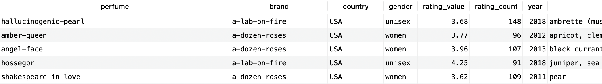

**Find possible duplicate perfumes by name and brand**

SELECT brand, perfume, COUNT(*)

FROM frags

GROUP BY brand, perfume

HAVING COUNT(*) > 1;

**2. Total fragrances**

SELECT COUNT(*) AS total_fragrances FROM frags;

   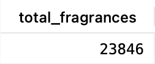
   
**3. Distinct brands**

SELECT DISTINCT brand FROM frags ORDER BY brand;

   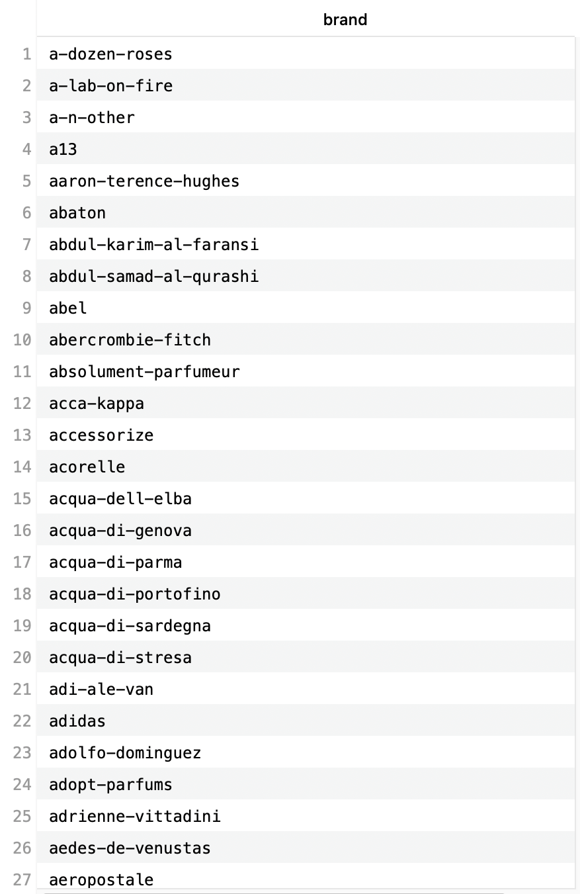

**4. Number of fragrances per brand**

SELECT brand, COUNT(*) AS num_fragrances

FROM frags

GROUP BY brand

ORDER BY num_fragrances DESC;

   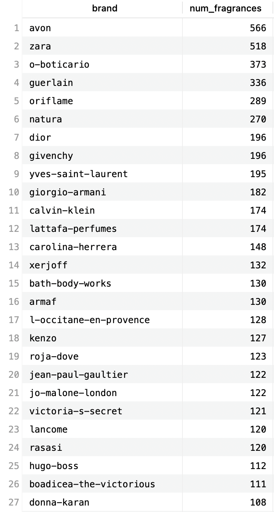

**5. Number of releases per year**

SELECT year, COUNT(*) AS releases

FROM frags

GROUP BY year

ORDER BY year;

   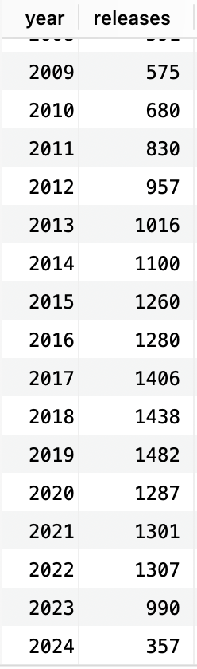

**6. Most common accords (mainaccord1 to mainaccord5)**

SELECT main_accord, COUNT(*) AS freq

FROM (

  SELECT mainaccord1 AS main_accord FROM frags
  UNION ALL

  SELECT mainaccord2 FROM frags
  UNION ALL

  SELECT mainaccord3 FROM frags
  UNION ALL

  SELECT mainaccord4 FROM frags
  UNION ALL

  SELECT mainaccord5 FROM frags

) sub

WHERE main_accord IS NOT NULL

GROUP BY main_accord

ORDER BY freq DESC

LIMIT 10;

   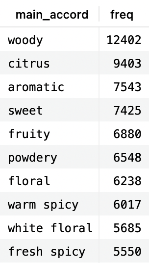

**7. Most common accord combinations**

WITH accord_combos AS (

  SELECT CONCAT_WS(', ', mainaccord1, mainaccord2, mainaccord3) AS accord_combo

  FROM frags

  WHERE mainaccord1 IS NOT NULL AND mainaccord2 IS NOT NULL AND mainaccord3 IS NOT NULL
)
SELECT accord_combo, COUNT(*) AS combo_count

FROM accord_combos

GROUP BY accord_combo

ORDER BY combo_count DESC

LIMIT 5;

   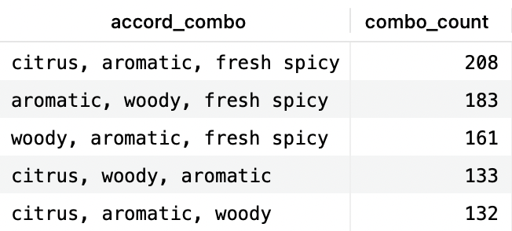

**8. Year-over-year brand growth**

WITH brand_year_counts AS (

  SELECT brand, year, COUNT(*) AS releases

  FROM frags

  WHERE year IS NOT NULL
  
  GROUP BY brand, year
),
growth_calc AS (

  SELECT brand, year, releases,

releases - LAG(releases) OVER (PARTITION BY brand ORDER BY year) AS release_growth

  FROM brand_year_counts
)
SELECT *

FROM growth_calc

WHERE release_growth IS NOT NULL

ORDER BY release_growth DESC

LIMIT 10;

   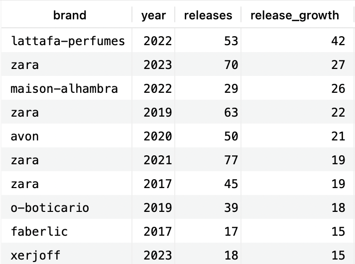

**9. Signature accord per brand**

WITH accord_brand_union AS (

  SELECT brand, mainaccord1 AS accord FROM frags
  UNION ALL

  SELECT brand, mainaccord2 FROM frags
  UNION ALL

  SELECT brand, mainaccord3 FROM frags
  UNION ALL

  SELECT brand, mainaccord4 FROM frags
  UNION ALL

  SELECT brand, mainaccord5 FROM frags

),
accord_rank AS (

  SELECT brand, accord, COUNT(*) AS freq,

 RANK() OVER (PARTITION BY brand ORDER BY COUNT(*) DESC) AS rank

  FROM accord_brand_union

  WHERE accord IS NOT NULL

  GROUP BY brand, accord

)
SELECT brand, accord AS signature_accord, freq

FROM accord_rank

WHERE rank = 1

ORDER BY freq DESC

LIMIT 15;

   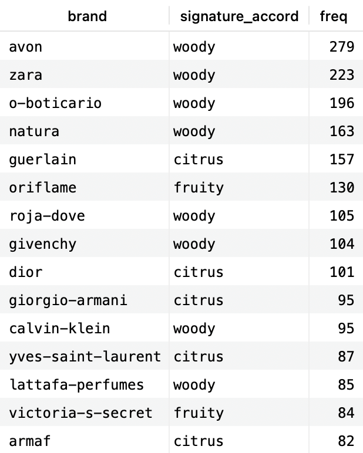

**10. First fragrance per brand**

SELECT perfume, brand, country, gender, rating_value, rating_count, year, top, middle, base, perfumer1, perfumer2, mainaccord1, mainaccord2, mainaccord3, mainaccord4, mainaccord5, rn 

FROM (
  SELECT *, ROW_NUMBER() OVER (PARTITION BY brand ORDER BY year) AS rn
  FROM frags
  WHERE year IS NOT NULL
) sub

WHERE rn = 1

ORDER BY brand;

   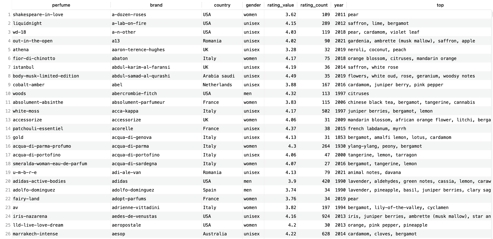

**11. Most recent fragrance per brand**
SELECT perfume, brand, country, gender, rating_value, rating_count, year, top, middle, base, perfumer1, perfumer2, mainaccord1, mainaccord2, mainaccord3, mainaccord4, mainaccord5, rn 
FROM (

  SELECT *, ROW_NUMBER() OVER (PARTITION BY brand ORDER BY year DESC) AS rn

  FROM frags

  WHERE brand IS NOT NULL

) sub

WHERE rn = 1

ORDER BY brand;

   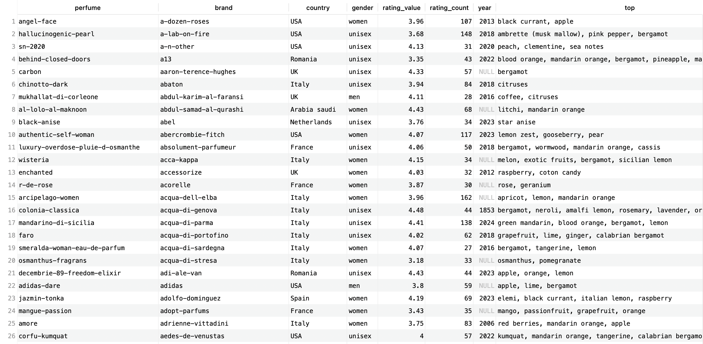

**View: top 10 brands by fragrance count**

CREATE VIEW top_10_brands AS

SELECT brand, COUNT(*) AS num_fragrances

FROM frags

GROUP BY brand

ORDER BY num_fragrances DESC LIMIT 10;

SELECT * FROM top_10_brands;

   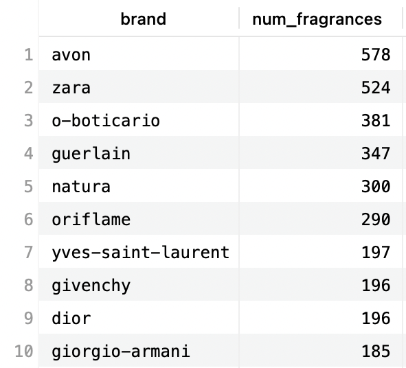

 
**View: yearly brand release counts**

CREATE VIEW yearly_brand_perfume_count AS

SELECT brand, year, COUNT(*) AS releases

FROM frags

GROUP BY brand, year;

SELECT * FROM yearly_brand_perfume_count;

   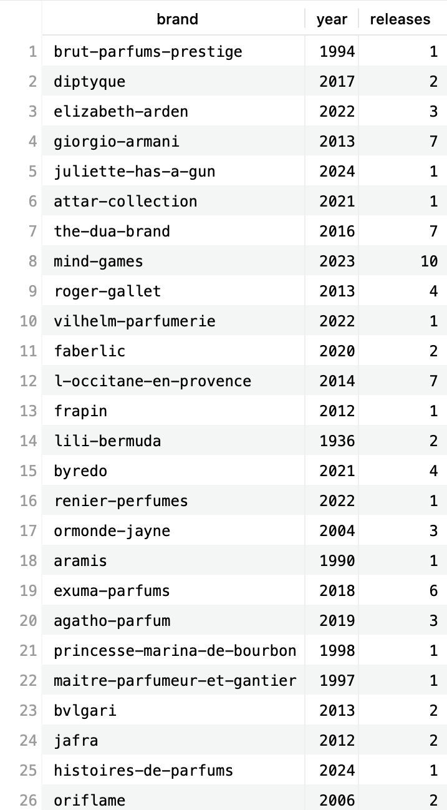
